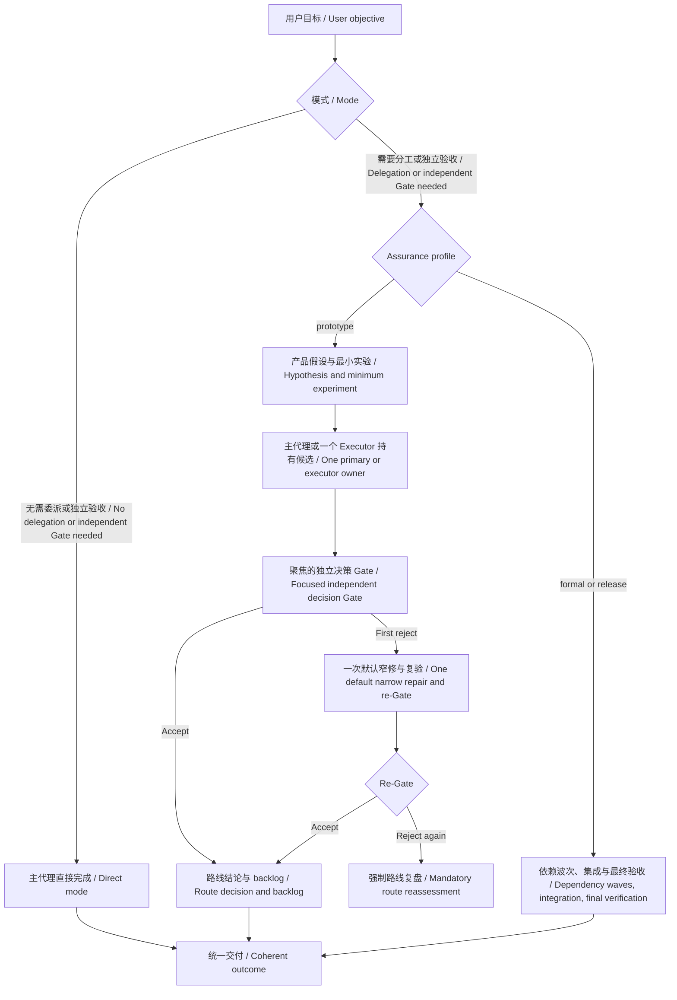

# Orchestrate Work

[中文](#中文) | [English](#english)



## 中文

`orchestrate-work` 保持用户目标、主线所有权和独立验收的一致性。紧耦合的调查、实现和作者自检可以由主代理连续完成；有并行、上下文隔离或成批降档价值的工作再委派。重大协调、冲突判断或监督与执行争夺注意力时，保留不参与实现的主控。

显式调用 `$orchestrate-work` 不意味着必须凑齐几个代理。是否分工与需要什么验收证据分别判断，任务长、文件多、需要多轮调试本身不要求交接。普通低影响任务直接处理；重要结果及明确指定的 profile 保留独立验收。用户禁止委派时继续已授权工作和相称自检，明确未完成的独立保证，不能把自检称为独立 Gate。

主代理可以实现，但不能给自己的成果签发独立验收结论。只有另一名未参与实现的 Verifier 对当前候选给出不可修改的通过结论后，主控才能据此记录验收；不得覆盖拒绝结论或放宽标准来批准自己的成果。验收期间冻结候选，不接纳旧版本证据。

每份子代理合同都必须直接携带 `worker`、剩余派工深度为 `0`、禁止创建 Codex 代理或任务、禁止再次调用 `orchestrate-work` 四项固定声明。子任务需要继续拆分时交回主控。主代理自己实现时不需要给自己派工；业务系统 Task 仍按目标和副作用权限处理。

### 模型与工作段

路由单位是一段有明确完成边界的连续工作，包含相关调查、实现、自检和窄修。已选择的 Astra 主代理适合持有需要持续判断的主线；大批普通实现优先 Terra，成批确定性核对优先 Luna，Sol 保留用于适合它的高要求判断或可用替代。模型和推理强度一起评估，尊重用户指定及实际工具能力，不自动更改当前会话模型。

主线中的几个机械步骤不触发换人；进入可独立交接的大批普通工作时重新判断降档。Astra/Sol 工作段仍有预算和边界，续用需要具体能力或上下文连续性理由。比较总执行、交接、返工和验收成本，不假设跨模型缓存命中，也不宣称未经实测的节省。完整规则与官方依据见 `references/routing-policy.md`。

### Assurance Profiles

- `prototype`：优先尽快判断产品路线是否可行。
- `formal`：在原型风险底线之上，增加相称的独立验证、阶段回归和最终集成验收。
- `release`：再增加可复现环境、外部依赖和发布准备检查。

按用户要得到的结果选择 profile。用户明确指定 `prototype`、`formal` 或 `release` 时，该指定优先。否则，只有明确是探索性结果时才使用 `prototype`：可行性判断、概念验证（POC）、spike 或可丢弃的最小实验。耐用、可合并、完整、生产使用或其他交付导向的结果使用 `formal`；非简单任务意图不明确时也使用 `formal`。仅有“快速”、“MVP”或“试试”并不会把耐用实现降为 `prototype`。`release` 只用于用户明确要求的发布或就绪性保证。已经开始的 phase 不会被主控擅自降级。

### Prototype 行为

每个原型实验先记录：

- `Hypothesis`：要验证什么。
- `Minimum experiment`：得出判断所需的最小实验。
- `Decision threshold`：什么证据足以改变路线判断。
- `Nonblocking backlog`：暂不阻塞实验的工程风险。
- Gate/repair budget：默认一次独立决策 Gate，加一次窄修和复验。

同一实验所需的 wrapper、字段适配和小修放在同一候选中，不按文件、字段或缺陷拆 Gate。Gate 以一次聚焦的端到端检查为核心；如果某项额外检查不会改变路线可行性、结论可信度、权限或副作用安全、最低可复核性判断，就进入 backlog。

原型仍保留风险底线：可能得出错误结论、越权或超预算副作用、不可逆风险、结果无法最低限度复核、职责边界被破坏的问题必须阻断。

第一次 Gate 拒绝后，原执行代理默认做一次窄修并复验。再次拒绝会停止自动修复链并强制重新判断假设、抽象和实验设计；只有记录了新证据、验收关键性和可信收敛路径后才能继续。

单候选且没有实质集成的原型，可以由同一个明确签约的独立 Gate 同时承担最终检查。多候选、接口组合或集成修改仍需要独立的集成验收。

### 可靠交接

普通本地低风险步骤使用明确工件和针对性作者证据，不默认建立完整回执。独立验收、证据复用、跨所有权或可变状态交接时，按规则核对候选身份和必要回执。文件缺失或不匹配属于交接未完成，不另开质量 Gate。主代理也是作者时，副作用预算、所有权和证据规则同样适用。

长任务由主控发送合成心跳，说明当前目标或假设、最近的决策证据、收敛与副作用预算，以及下一决策或停止条件。

### 安装

```powershell
git clone https://github.com/Linsongrong/orchestrate-work.git "$env:USERPROFILE\.codex\skills\orchestrate-work"
```

```bash
git clone https://github.com/Linsongrong/orchestrate-work.git ~/.codex/skills/orchestrate-work
```

### 使用

```text
Use $orchestrate-work to run a disposable experiment and decide whether this SDK is feasible.
```

核心规则在 `SKILL.md`；模型路由、profile、Gate、恢复和所有权规则在 `references/routing-policy.md`；跨 compaction 的主控恢复在 `references/checkpoint-protocol.md`；紧凑的子代理合同在 `references/task-contract.md`。

## English

`orchestrate-work` preserves user intent, continuous main-line ownership, and independent verification. The primary agent may own coupled investigation, implementation, and author checks. Delegate for real parallelism, context isolation, or substantial routine batches. Keep a non-executing controller when consequential coordination, conflicting evidence, or oversight competes with execution.

Explicit invocation does not impose a minimum agent count. Choose execution ownership separately from assurance; duration, file count, and repeated debugging alone do not require handoffs. Ordinary low-impact work stays direct; important results and explicit profiles retain independent verification. If the user prohibits delegation, continue authorized work and proportional self-checks, disclose missing independent assurance, and do not call self-checks an independent Gate.

A primary author cannot issue its own independent verdict. It may record acceptance only from an immutable independent accept verdict for the current candidate, without overriding rejection or relaxing criteria to approve its work. Freeze candidates during verification and reject superseded evidence.

Every child contract carries the worker preamble, zero delegation depth, no Codex agent/task creation, and no skill reinvocation. Further decomposition returns to the primary. Primary authors do not self-dispatch; domain Task objects remain governed by the objective and side-effect authority.

### Models And Work Segments

Route a coupled objective through its completion boundary, including related diagnosis, implementation, checks, and narrow repairs. An already-selected Astra primary is a starting preference for context-dependent main lines; Terra handles substantial routine implementation, Luna handles batched deterministic checks, and Sol remains a suitable demanding-judgment or fallback option. Select model and effort together, respecting the user's selection and actual runtime capabilities; the skill does not switch the current primary model.

Adjacent mechanical steps do not trigger handoffs. Reassess for a substantial separable routine batch and prefer a sufficient cheaper route. Astra/Sol segments retain bounded budgets and require concrete capability or continuity reasons for renewal. Compare execution, transfer, repair, and verification costs without assuming cross-model cache hits or unmeasured savings. Full policy and official sources are in `references/routing-policy.md`.

### Assurance Profiles

- `prototype`: reach a trustworthy product-route decision quickly.
- `formal`: add proportional independent verification, a phase regression, and final integrated verification.
- `release`: add reproducible environment, external dependency, and release-readiness checks.

Select the profile from the outcome the user requests. An explicit selection of `prototype`, `formal`, or `release` always wins. Otherwise, use `prototype` only for an explicitly exploratory outcome: a feasibility decision, proof of concept, spike, or disposable minimum experiment. Use `formal` for a durable, mergeable, complete, production-use, or other delivery-oriented result, and for ambiguous nontrivial intent. Words such as "quick", "MVP", or "try" alone do not lower a durable implementation to `prototype`. Use `release` only for explicitly requested release or readiness assurance. The controller cannot silently downgrade an active phase.

### Prototype Behavior

Each prototype experiment records its `Hypothesis`, `Minimum experiment`, `Decision threshold`, `Nonblocking backlog`, and Gate/repair budget. Subchanges needed by the same experiment stay in one candidate instead of receiving file-level, field-level, or defect-level Gates.

One independent decision Gate, centered on a focused end-to-end check, is the default. An optional check blocks only when it can change route viability, conclusion validity, authority or side-effect safety, or minimum replayability and trust. Wrong conclusions, authority violations, budgeted or irreversible side effects, unreviewable results, and responsibility-boundary failures remain mandatory blockers.

After the first rejection, the original executor gets one default narrow repair and re-Gate. Another rejection stops the automatic repair chain and forces reassessment of the hypothesis, abstraction, and experiment design. Further repair requires recorded new evidence, acceptance criticality, and a credible convergence path.

For one candidate with no substantive integration, the explicitly contracted focused independent Gate may also serve as the final check. Multiple candidates, interface composition, or integration changes still require independent integrated verification.

### Reliable Handoffs

Ordinary local low-risk steps use declared artifacts and targeted author evidence without a full receipt by default. Verify candidate identity and necessary receipts for independent verification, evidence reuse, cross-owner, or mutable-state handoffs. A mismatch is an incomplete handoff, not another quality Gate. Primary authors follow the same side-effect, ownership, and evidence rules.

For long-running phases, the controller sends synthesized heartbeats with the objective or hypothesis, latest decision-relevant evidence, convergence and side-effect budget, and the next decision or stop condition.

### Installation

```powershell
git clone https://github.com/Linsongrong/orchestrate-work.git "$env:USERPROFILE\.codex\skills\orchestrate-work"
```

```bash
git clone https://github.com/Linsongrong/orchestrate-work.git ~/.codex/skills/orchestrate-work
```

### Usage

```text
Use $orchestrate-work to run a disposable experiment and decide whether this SDK is feasible.
```

Core behavior lives in `SKILL.md`; model routing, profiles, Gates, recovery, and ownership live in `references/routing-policy.md`; controller recovery across compaction lives in `references/checkpoint-protocol.md`; compact worker contracts live in `references/task-contract.md`.
