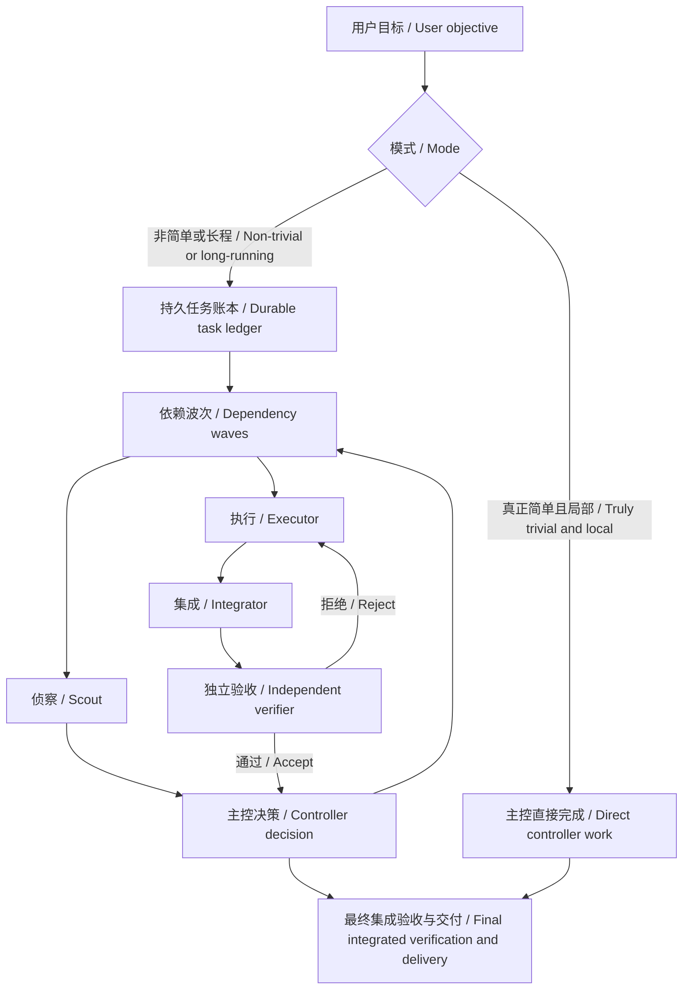

# Orchestrate Work

[中文](#中文) | [English](#english)



## 中文

`orchestrate-work` 是一个面向 Codex 的个人 Skill，用于以“主控优先”的方式协调非简单或长程工作。主控负责管理和裁决，而不是承担主要执行分支；侦察、实现、集成和独立验收交给边界明确的直接子代理。

显式调用 `$orchestrate-work` 时，除非任务确实简单且局部，否则会进入编排模式。隐式调用仍然启用，可用于存在独立工作流、大量探索或工具输出、长时间实现，或者重要结果需要独立验收的任务。

### 核心行为

- 建立持久任务账本，记录目标、验收标准、非目标、既定决策、依赖、工作状态、后续工作和风险；每个波次或重大决策后更新，并在上下文压缩后恢复。
- 按依赖波次派遣所有已就绪且互不冲突的工作流，不默认只派一个代理，也不为强依赖工作强行并行。
- 使用四种角色：侦察代理、执行代理、集成代理和验收代理。子代理不得继续创建代理；验收代理只报告，不修复产物。
- 根据任务复杂度选择模型：`gpt-5.6-luna` 处理确定性提取和常规检查，`gpt-5.6-terra` 处理常规实现、测试、文档和诊断，`gpt-5.6-sol` 处理复杂实现、研究、冲突分析和重要验收。
- 为文件、目录、产物和外部状态分配唯一所有者。只有真正互不影响时才共享工作树，否则使用隔离工作树并安排集成代理。
- 子代理只接收任务局部上下文，并以紧凑的结构返回产物位置、证据、发现和风险；原始日志留在子代理上下文中。
- 使用完成门槛、软超时和停滞检测，而不是固定分钟数。第一次验收失败退回原执行代理；第二次失败后重新评估模型、代理或方案；持续失败时停止该路线。
- 重要产物需要独立验收，最终集成结果必须完成适当验收。只有所有验收标准通过后才声明完成。
- 新分支只有在验收所必需、阻塞当前工作或推翻关键假设时才进入范围。重大范围变化由用户决定。
- 默认使用直接子代理。只有工作长期独立、需要用户单独控制或强工作树隔离时，才建议新建用户任务，并且必须先获得明确授权。

### 安装

PowerShell：

```powershell
git clone https://github.com/Linsongrong/orchestrate-work.git "$env:USERPROFILE\.codex\skills\orchestrate-work"
```

macOS / Linux：

```bash
git clone https://github.com/Linsongrong/orchestrate-work.git ~/.codex/skills/orchestrate-work
```

安装后开启新的 Codex 任务，使 Skill 被重新发现。

### 使用

```text
Use $orchestrate-work to coordinate this task through bounded agents and independent verification.
```

### 文件

- `SKILL.md`：两种模式、主控边界和核心控制循环。
- `references/routing-policy.md`：角色、模型、波次并行、所有权、恢复和升级规则。
- `references/task-contract.md`：四种角色的任务合同和紧凑返回格式。
- `agents/openai.yaml`：Codex 界面信息和隐式调用配置。

## English

`orchestrate-work` is a personal Codex Skill for controller-first coordination of non-trivial or long-running work. The controller manages and judges rather than owning a main execution branch; bounded direct child agents perform scouting, implementation, integration, and independent verification.

Explicit `$orchestrate-work` invocation enters orchestration mode unless the task is genuinely trivial and local. Implicit invocation remains enabled for tasks with independent workstreams, substantial exploration or tool output, long implementation, or important results that need an independent check.

### Core behavior

- Create a durable task ledger for the objective, acceptance criteria, non-goals, settled decisions, dependencies, work status, next work, and risks. Update it after each wave or material decision and restore it after context compaction.
- Dispatch all ready, non-conflicting workstreams in dependency waves. Do not default to one agent or force parallelism onto serial work.
- Use four roles: scout, executor, integrator, and verifier. Child agents may not spawn; verifiers report and never repair artifacts.
- Route adaptively: `gpt-5.6-luna` for deterministic extraction and routine checks, `gpt-5.6-terra` for routine implementation, tests, docs, and diagnosis, and `gpt-5.6-sol` for complex implementation, research, conflict analysis, and important verification.
- Assign one owner to each file, directory, artifact, and external state. Share a worktree only for truly non-interacting changes; otherwise isolate worktrees and appoint an integrator.
- Give agents task-local context and require compact returns with artifact locations, evidence, findings, and risks. Keep raw logs in worker context.
- Use completion gates, soft timeouts, and stall detection instead of fixed minute limits. Return a first verification failure to the original executor, reassess the model, agent, or approach after a second failure, and stop a repeatedly failing route.
- Independently verify important artifacts and always verify the final integrated result appropriately. Claim completion only after every acceptance criterion passes.
- Admit side branches only when acceptance requires them, current work is blocked, or a key assumption is disproved. Ask the user about material scope changes.
- Use direct child agents by default. Suggest a new user-owned task only for long-lived independently steerable work or strong worktree isolation, and obtain explicit authorization first.

### Installation

PowerShell:

```powershell
git clone https://github.com/Linsongrong/orchestrate-work.git "$env:USERPROFILE\.codex\skills\orchestrate-work"
```

macOS / Linux:

```bash
git clone https://github.com/Linsongrong/orchestrate-work.git ~/.codex/skills/orchestrate-work
```

Start a new Codex task after installation so the Skill can be rediscovered.

### Usage

```text
Use $orchestrate-work to coordinate this task through bounded agents and independent verification.
```

### Files

- `SKILL.md`: Two modes, controller boundaries, and the core control loop.
- `references/routing-policy.md`: Roles, models, wave parallelism, ownership, recovery, and escalation.
- `references/task-contract.md`: Contracts and compact returns for all four roles.
- `agents/openai.yaml`: Codex UI metadata and implicit invocation policy.
