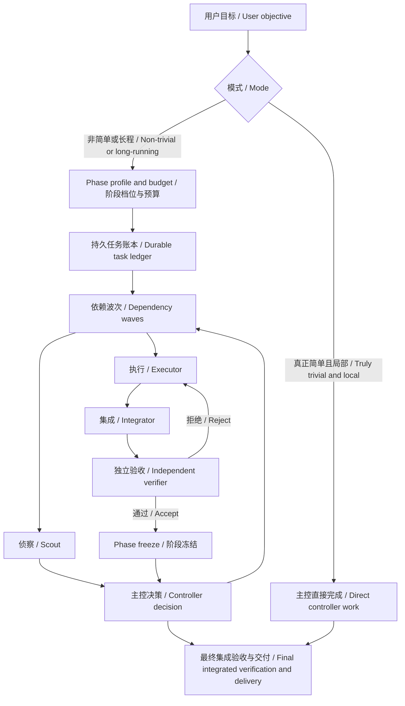

# Orchestrate Work

[中文](#中文) | [English](#english)



## 中文

`orchestrate-work` 是一个面向 Codex 的个人 Skill，用于以“主控优先”的方式协调非简单或长程工作。主控负责管理和裁决，而不是承担主要执行分支；侦察、实现、集成和独立验收交给边界明确的直接子代理。

显式调用 `$orchestrate-work` 时，除非任务确实简单且局部，否则会进入编排模式。隐式调用仍然启用，可用于存在独立工作流、大量探索或工具输出、长时间实现，或者重要结果需要独立验收的任务。

### 核心行为

- 建立持久任务账本，记录目标、验收标准、非目标、既定决策、依赖、工作状态、后续工作和风险；每个波次或重大决策后更新，并在上下文压缩后恢复。
- 每个 phase 先选择 assurance profile：默认 `formal`；只有明确要求快速原型时使用 `prototype`；`release` 只在明确请求时使用。`formal` 保留全部原型保障并增加相称的独立验证，`release` 再增加环境、依赖和发布审计。原型对每个主要实现保留独立 Gate 和聚焦端到端检查；失败只记录候选标识、发现、复现证据、结论和下一步，把 manifest、sidecar、历史复验和大型索引延后到最终 ACCEPT，除非策略或风险另有要求。状态变更和明确非规范性文档变更可以不重复功能 Gate；规则、prompt、schema、policy 或其他定义行为的文本是功能候选，必须有相应 Gate 覆盖。一般只做一次 phase 级完整回归。
- 对付费模型调用、真实运行、远程写入、不可逆操作和密钥持久化设置显式预算；预算耗尽后，子代理必须交回主控续发，不能自行重试。
- 按依赖波次派遣所有已就绪且互不冲突的工作流，不默认只派一个代理，也不为强依赖工作强行并行。
- 使用四种角色：侦察代理、执行代理、集成代理和验收代理。子代理不得继续创建代理；验收代理只报告，不修复产物。
- 每次子代理派遣都显式指定模型、推理强度和理由，禁止无意继承；同主控配置也必须明确写出。模型由工作形态决定，而非只因提高强度而更换：`gpt-5.6-luna` 的基线为 `low`，仅在有限歧义、多源协调或常规检查需要判断时升到 `medium`；`gpt-5.6-terra` 的基线为 `medium`，仅在跨边界实现、诊断存在歧义或集成风险显著时升到 `high`；`gpt-5.6-sol` 的基线为 `high`，仅在高风险或有歧义的信任、架构、冲突或对抗性验收时升到 `xhigh`。`max` 仅作为 Sol 路线的例外升级：只有 `xhigh` 已证明不足且质量或风险有充分理由时才使用，并记录证据和理由。运行时回退必须记录请求和实际路线、原因与置信度影响；失败先判断合同或方案问题，再因有证据的能力缺口升级。
- 为文件、目录、产物和外部状态分配唯一所有者。只有真正互不影响时才共享工作树，否则使用隔离工作树并安排集成代理。
- 并发共享工作树时在总账记录路径 ownership map；候选进入独立验收后冻结功能路径，验收代理只读，集成代理只改被分配的整合路径。
- 区分功能候选、独立验收结论与状态整合：验收结论不可改候选，状态整合不可改 verdict；是否分别提交由仓库策略决定。
- 子代理只接收任务局部上下文，并以紧凑的结构返回产物位置、候选 digest、证据、发现和风险；证据按候选标识、命令、环境、结果和所有者复用，只有候选或环境变化、证据缺失或不可信、或明确需要独立复现时才重跑。合同明确写出本角色负责、已满足且不得重跑的检查；原始日志留在子代理上下文中。
- 检查按角色分配：执行代理做目标作者检查，验收代理做正交的验收和风险检查，集成代理做跨组件检查，受明确合同委派的最终验收代理做一次最终集成检查，主控只裁决证据而不重复执行。验收首轮先识别规则和证据的权威来源，必要时质疑候选与证明可共同修改的自证循环。
- 使用完成门槛、软超时和停滞检测，而不是固定分钟数。只要每轮都有新证据并趋近验收，就继续验收关键修复；相同失败重复、没有新证据、非关键加固占用主线或两轮不收敛时，重新评估并改路线或进入 backlog，不设通用的一次修复上限。
- 用户更新由主控综合，不转发子代理原始进度；默认只说明当前目标、phase 进度或结果、收敛情况、停止条件和所需用户动作，按需再展开细节。
- 重要产物需要独立验收，最终集成结果必须完成适当验收。只有所有验收标准通过后才声明完成。
- 新分支只有在验收所必需、阻塞当前工作或推翻关键假设时才进入范围。重大范围变化由用户决定。
- phase 被接受后，先记录完成交付物、未完成非目标、最新 Gate、下一 objective、profile 和授权；没有这一步，“继续”不能自然扩展为下一大阶段。
- 子代理只能使用完成合同所需的专业技能，不能再次调用 `orchestrate-work`、派工或新建任务；需要拆分时必须交回主控。
- 默认使用直接子代理。只有工作长期独立、需要用户单独控制或强工作树隔离时，才建议新建用户任务，并且必须先获得明确授权。

### 安装

PowerShell：

```powershell
git clone https://github.com/Linsongrong/orchestrate-work.git "$env:USERPROFILE\.codex\skills\orchestrate-work"
```

macOS / Linux：

```bash
git clone https://github.com/Linsongrong/orchestrate-work.git ~/.codex/skills/orchestrate-work
```

Codex 会自动检测 Skill 更新；若列表或调用结果未刷新，再重启 Codex。

### 使用

```text
Use $orchestrate-work to coordinate this task through bounded agents and independent verification.
```

### 文件

- `SKILL.md`：两种模式、主控边界和核心控制循环。
- `references/routing-policy.md`：角色、模型、波次并行、所有权、恢复和升级规则。
- `references/task-contract.md`：四种角色的任务合同和紧凑返回格式。
- `agents/openai.yaml`：Codex 界面信息和隐式调用配置。

## English

`orchestrate-work` is a personal Codex Skill for controller-first coordination of non-trivial or long-running work. The controller manages and judges rather than owning a main execution branch; bounded direct child agents perform scouting, implementation, integration, and independent verification.

Explicit `$orchestrate-work` invocation enters orchestration mode unless the task is genuinely trivial and local. Implicit invocation remains enabled for tasks with independent workstreams, substantial exploration or tool output, long implementation, or important results that need an independent check.

### Core behavior

- Create a durable task ledger for the objective, acceptance criteria, non-goals, settled decisions, dependencies, work status, next work, and risks. Update it after each wave or material decision and restore it after context compaction.
- Select an assurance profile for each phase: `formal` by default, `prototype` only for an explicitly requested rapid prototype, and `release` only when explicitly requested. Formal retains every prototype safeguard and adds proportional independent verification; release adds environment, dependency, and release audits. Prototype retains an independent Gate for each major implementation and a focused end-to-end check; a rejection records only candidate identity, finding, reproduction evidence, verdict, and next action while manifests, sidecars, history revalidation, and large indexes wait for final ACCEPT unless policy or risk requires them. Status-only and explicitly non-normative documentation changes may avoid a functional re-Gate; rules, prompts, schemas, policies, and other behavior-defining text are functional candidates requiring appropriate Gate coverage. One phase-level full regression is the default.
- Set an explicit budget for paid model calls, real runs, remote writes, irreversible actions, and secret persistence. Workers must return to the controller for renewal rather than retrying after exhaustion.
- Dispatch all ready, non-conflicting workstreams in dependency waves. Do not default to one agent or force parallelism onto serial work.
- Use four roles: scout, executor, integrator, and verifier. Child agents may not spawn; verifiers report and never repair artifacts.
- Explicitly choose a model, reasoning effort, and rationale for every child dispatch; accidental inheritance is prohibited, including when intentionally matching the controller. Tie model choice to work shape, not effort alone: start `gpt-5.6-luna` at `low` and raise to `medium` only for bounded ambiguity, multi-source reconciliation, or routine checks needing judgment; start `gpt-5.6-terra` at `medium` and raise to `high` only for cross-boundary implementation, ambiguous diagnosis, or meaningful integration risk; start `gpt-5.6-sol` at `high` and raise to `xhigh` only for high-stakes or ambiguous trust, architecture, conflict, or adversarial verification. Use `max` only as an exceptional Sol escalation after `xhigh` is demonstrably insufficient and the quality or risk justifies it; record the evidence and rationale. Record requested and actual routes, fallback reason, and confidence impact; diagnose contract or approach before escalating for an evidenced capability gap.
- Assign one owner to each file, directory, artifact, and external state. Share a worktree only for truly non-interacting changes; otherwise isolate worktrees and appoint an integrator.
- Record a path ownership map for concurrent writers in a shared worktree. Freeze candidate paths during independent verification; verifiers are read-only and integrators modify only assigned integration paths.
- Keep functional candidates, independent verdicts, and status integration separate. Verdicts never modify candidates, and status integration never changes a verdict; repository policy decides whether they become separate commits.
- Give agents task-local context and require compact returns with artifact locations, candidate digests, evidence, findings, and risks. Reuse evidence only when candidate identity, command, environment, result, and owner remain applicable and trusted; contracts name checks owned, already satisfied, and not to rerun. Keep raw logs in worker context.
- Assign verification ownership: executors run targeted author checks, verifiers run orthogonal acceptance and risk checks, integrators run cross-component checks, and a specifically contracted final verifier runs one final integrated check. The controller judges evidence instead of duplicating owned checks. On a verifier's first pass, identify authoritative rules and evidence and challenge self-authenticating or co-mutable candidate/proof loops where relevant.
- Use completion gates, soft timeouts, and stall detection instead of fixed minute limits. Continue acceptance-critical repair while each iteration produces new evidence and approaches acceptance; reassess, backlog, or change route when the same failure repeats, evidence stops improving, noncritical hardening consumes the main line, or two rounds do not converge. There is no universal one-repair limit.
- User updates are controller-synthesized convergence summaries, never raw child progress: objective, phase result or progress, convergence, stop condition, and user action needed by default; expand only on request.
- Independently verify important artifacts and always verify the final integrated result appropriately. Claim completion only after every acceptance criterion passes.
- Admit side branches only when acceptance requires them, current work is blocked, or a key assumption is disproved. Ask the user about material scope changes.
- After accepting a phase, record completed deliverables, explicit non-goals, the latest Gate, next objective, profile, and authority. Without that freeze, "continue" cannot silently become the next large phase.
- Child agents may use specialist skills needed for their contract, but may not invoke `orchestrate-work`, delegate, or create tasks; they return decomposition needs to the controller.
- Use direct child agents by default. Suggest a new user-owned task only for long-lived independently steerable work or strong worktree isolation, and obtain explicit authorization first.

### Installation

PowerShell:

```powershell
git clone https://github.com/Linsongrong/orchestrate-work.git "$env:USERPROFILE\.codex\skills\orchestrate-work"
```

macOS / Linux:

```bash
git clone https://github.com/Linsongrong/orchestrate-work.git ~/.codex/skills/orchestrate-work
```

Codex detects Skill updates automatically. Restart Codex only if the skill list or invocation does not refresh.

### Usage

```text
Use $orchestrate-work to coordinate this task through bounded agents and independent verification.
```

### Files

- `SKILL.md`: Two modes, controller boundaries, and the core control loop.
- `references/routing-policy.md`: Roles, models, wave parallelism, ownership, recovery, and escalation.
- `references/task-contract.md`: Contracts and compact returns for all four roles.
- `agents/openai.yaml`: Codex UI metadata and implicit invocation policy.
