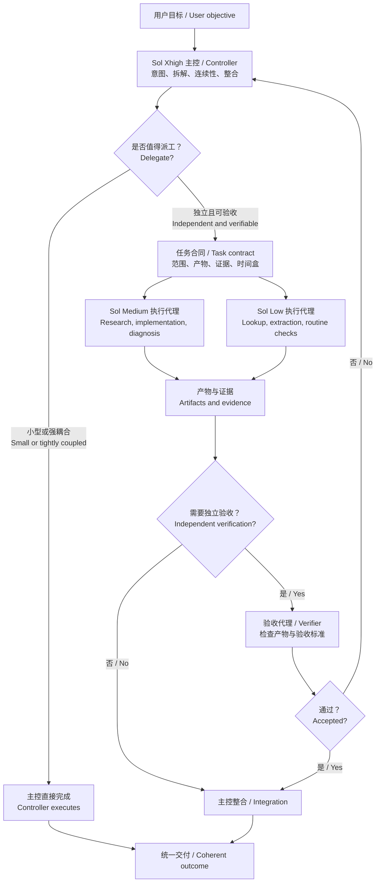

# Orchestrate Work

[中文](#中文) | [English](#english)



## 中文

`orchestrate-work` 是一个面向 Codex 的个人 Skill，用于把非简单或长程任务组织成“主控、执行代理、独立验收”的工作流，在保护主会话上下文的同时避免为了并行而过度拆分任务。

主控始终负责理解用户意图、任务拆解、关键决策、冲突处理、结果整合和最终交付。子代理只接收边界明确的任务包，并返回产物、证据、风险和需要主控处理的事项。

### 主要能力

- 自动判断任务应该直接完成、串行执行还是并行派工。
- 主控使用 `gpt-5.6-sol` 的 high 或 xhigh 推理，子代理显式使用同一模型的 low 或 medium 推理。
- 使用标准任务合同限制子代理的目标、范围、交付物和升级条件。
- 子代理只接收任务局部上下文，避免复制整个长会话。
- 避免多个代理同时修改相同文件或外部状态。
- 为重要结果增加独立验收，而不是让执行代理自行证明正确。
- 为子任务设置时间盒，并在超时后使用已有证据继续交付。
- 默认只启动一个执行代理；只有真正独立且能缩短关键路径时才增加并行度。
- 维护紧凑的长任务连续性检查点，降低上下文压缩后的目标漂移。

### 直接完成门槛

Skill 默认由主控直接执行。满足以下任一情况时不会创建执行代理：

- 整个任务可以在不超过三次短工具调用内完成和验证，且不会产生大量上下文。
- 工作步骤强耦合，无法独立验收。
- 描述和复核子代理的成本不低于被隔离的执行或上下文成本。
- 子代理需要大部分完整会话才能避免猜测。
- 任务依赖尚未解决的用户选择。

只有任务边界、可验收性、自治性和派遣收益全部成立时才会派遣。多个文件、评估维度或报告标题不等于多个独立工作流。

### 安装

PowerShell：

```powershell
git clone https://github.com/Linsongrong/orchestrate-work.git "$env:USERPROFILE\.codex\skills\orchestrate-work"
```

macOS / Linux：

```bash
git clone https://github.com/Linsongrong/orchestrate-work.git ~/.codex/skills/orchestrate-work
```

安装后开启一个新的 Codex 任务，使 Skill 被重新发现。

### 使用

Skill 已启用隐式调用。面对存在独立工作流或需要独立验收的复杂任务时，Codex 可以自动使用它，不需要每次点名。

也可以显式调用：

```text
Use $orchestrate-work to complete this task with appropriate delegation and verification.
```

### 工作流

```text
用户目标
  -> 主控判断是否值得派工
  -> 建立依赖关系和任务边界
  -> 执行代理处理独立工作流
  -> 必要时由独立代理验收
  -> 主控解决冲突并整合结果
  -> 向用户交付一个统一结论
```

### 文件结构

```text
orchestrate-work/
├── SKILL.md
├── agents/
│   └── openai.yaml
└── references/
    ├── routing-policy.md
    └── task-contract.md
```

- `SKILL.md`：核心决策与编排流程。
- `routing-policy.md`：模型、推理强度、并行和升级规则。
- `task-contract.md`：执行代理与验收代理的任务合同。
- `openai.yaml`：Codex 界面信息和隐式调用配置。

## English

`orchestrate-work` is a personal Codex Skill for coordinating non-trivial or long-running work through a controller, bounded worker agents, and independent verification. It protects controller context without creating agents merely for the sake of parallelism.

The controller always owns user intent, decomposition, consequential decisions, conflict resolution, integration, and final delivery. Workers receive bounded task contracts and return artifacts, evidence, risks, and decisions that require controller attention.

### Key capabilities

- Decide whether work should be handled directly, sequentially, or in parallel.
- Use `gpt-5.6-sol` at high or xhigh effort for the controller and explicitly route workers to the same model at low or medium effort.
- Bound worker objectives, scope, deliverables, and escalation conditions with a standard task contract.
- Give workers task-local context instead of copying the full long-running conversation.
- Prevent concurrent agents from editing the same files or external state.
- Add independent verification for important results instead of relying on worker self-assessment.
- Timebox delegated work and continue from available evidence when a worker overruns its collection window.
- Start with one execution worker and add parallelism only for genuinely independent critical-path work.
- Maintain a compact continuity checkpoint to reduce drift after context compaction.

### Direct-work gate

The Skill defaults to direct controller execution and does not create workers when any of these applies:

- The complete task can be performed and verified in three or fewer short tool calls without substantial context output.
- The steps are tightly coupled and cannot be verified independently.
- Specifying and reviewing a worker costs at least as much as the execution or context it would isolate.
- A worker would need most of the full conversation to avoid guessing.
- The task depends on an unresolved user choice.

Delegation requires all four properties: a clear boundary, independent verifiability, worker autonomy, and meaningful payoff. Multiple files, review dimensions, or report headings do not automatically constitute independent workstreams.

### Installation

PowerShell:

```powershell
git clone https://github.com/Linsongrong/orchestrate-work.git "$env:USERPROFILE\.codex\skills\orchestrate-work"
```

macOS / Linux:

```bash
git clone https://github.com/Linsongrong/orchestrate-work.git ~/.codex/skills/orchestrate-work
```

Start a new Codex task after installation so the Skill can be discovered.

### Usage

Implicit invocation is enabled. Codex can automatically use the Skill for complex tasks with independent workstreams or meaningful verification needs.

It can also be invoked explicitly:

```text
Use $orchestrate-work to complete this task with appropriate delegation and verification.
```

### Workflow

```text
User objective
  -> Controller applies the delegation gate
  -> Controller maps dependencies and ownership
  -> Workers execute independent workstreams
  -> An independent agent verifies important results when needed
  -> Controller resolves conflicts and integrates evidence
  -> User receives one coherent outcome
```

### Repository structure

```text
orchestrate-work/
├── SKILL.md
├── agents/
│   └── openai.yaml
└── references/
    ├── routing-policy.md
    └── task-contract.md
```

- `SKILL.md`: Core orchestration and decision workflow.
- `routing-policy.md`: Model, reasoning effort, parallelism, budget, and escalation rules.
- `task-contract.md`: Worker and verifier assignment contracts.
- `openai.yaml`: Codex UI metadata and implicit invocation policy.
