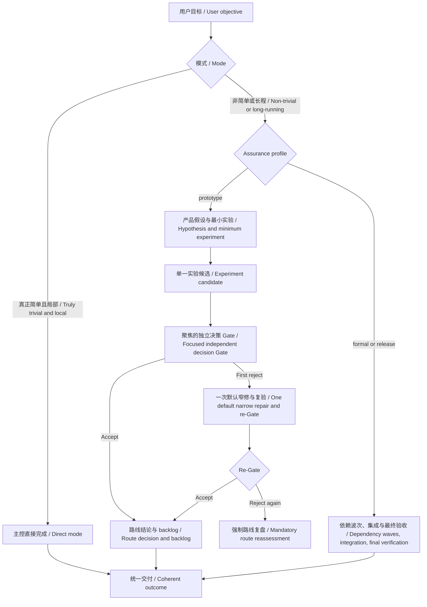

# Orchestrate Work

[中文](#中文) | [English](#english)



## 中文

`orchestrate-work` 用主控、边界明确的专业代理、持久任务状态和独立验收来协调非简单或长程工作。主控负责意图、拆解、决策、冲突处理和最终交付，不承担需要多轮探索、实现或调试的主要执行分支。

显式调用 `$orchestrate-work` 时，除非任务确实简单且局部，否则进入编排模式。编排中的机械、局部、低风险小事可以作为 `direct unit` 由主控直接处理，不为状态更新、文件存在性或 digest 核对单开代理和 Gate。

每份子代理合同都必须直接携带 `worker`、剩余派工深度为 `0`、禁止创建代理或任务、禁止再次调用 `orchestrate-work` 四项固定声明。子任务需要继续拆分时只能交回主控，不能形成嵌套编排。

### Assurance Profiles

- `prototype`：优先尽快判断产品路线是否可行。
- `formal`：在原型风险底线之上，增加相称的独立验证、阶段回归和最终集成验收。
- `release`：再增加可复现环境、外部依赖和发布准备检查。

只有用户明确要求快速原型时才使用 `prototype`；已经开始的 phase 不会被主控擅自降级。

### Prototype 行为

每个原型实验先记录：

- `Hypothesis`：要验证什么。
- `Minimum experiment`：得出判断所需的最小实验。
- `Decision threshold`：什么证据足以改变路线判断。
- `Nonblocking backlog`：暂不阻塞实验的工程风险。
- Gate/repair budget：默认一次独立决策 Gate，加一次窄修和复验。

同一实验所需的 wrapper、字段适配和小修放在同一候选中，不按文件、字段或缺陷拆 Gate。Gate 以一次聚焦的端到端检查为核心；如果某项额外检查不会改变路线可行性、结论可信度、权限或副作用安全、最低可复核性判断，就进入 backlog。

原型仍保留风险底线：可能得出错误结论、越权或超预算副作用、不可逆风险、结果无法最低限度复核、职责边界被破坏的问题必须阻断。

第一次 Gate 拒绝后，原执行代理默认做一次窄修并复验。再次拒绝会停止自动修复链并强制重新判断假设、抽象和实验设计；只有记录了新证据、验收关键性和可信收敛路径后才能继续。

单候选且没有实质集成的原型，可以由同一个明确签约的独立 Gate 同时承担最终检查。多候选、接口组合或集成修改仍需要独立的集成验收。

### 可靠交接

写入工件的代理在返回前报告绝对路径、类型、大小、可读性和适用时的 digest。主控在接受结果或派验收代理前立即确认这些信息。文件缺失或不匹配属于交接未完成，不会再创建一个质量 Gate。

长任务由主控发送合成心跳，说明当前目标或假设、最近的决策证据、收敛与副作用预算，以及下一决策或停止条件。

### 安装

```powershell
git clone https://github.com/Linsongrong/orchestrate-work.git "$env:USERPROFILE\.codex\skills\orchestrate-work"
```

```bash
git clone https://github.com/Linsongrong/orchestrate-work.git ~/.codex/skills/orchestrate-work
```

### 使用

```text
Use $orchestrate-work in prototype mode to test this product hypothesis through the minimum viable experiment.
```

核心规则在 `SKILL.md`；模型路由、profile、Gate、恢复和所有权规则在 `references/routing-policy.md`；紧凑的子代理合同在 `references/task-contract.md`。

## English

`orchestrate-work` coordinates non-trivial or long-running work through a controller, bounded specialist agents, durable state, and independent verification. The controller owns intent, decomposition, decisions, conflict resolution, and delivery instead of taking a main branch that requires repeated exploration, implementation, or debugging.

Explicit invocation normally enters orchestration mode. Mechanical, local, low-risk work inside an orchestrated phase may run as a controller `direct unit`, so status updates, artifact existence checks, and digest reconciliation do not create separate agents or Gates.

Every child contract directly carries a fixed preamble declaring worker mode, zero remaining delegation depth, no agent or task creation, and no `orchestrate-work` invocation. Work that needs further decomposition returns to the controller instead of creating nested orchestration.

### Assurance Profiles

- `prototype`: reach a trustworthy product-route decision quickly.
- `formal`: add proportional independent verification, a phase regression, and final integrated verification.
- `release`: add reproducible environment, external dependency, and release-readiness checks.

Use `prototype` only when the user explicitly requests rapid prototyping. The controller cannot silently downgrade an active phase.

### Prototype Behavior

Each prototype experiment records its `Hypothesis`, `Minimum experiment`, `Decision threshold`, `Nonblocking backlog`, and Gate/repair budget. Subchanges needed by the same experiment stay in one candidate instead of receiving file-level, field-level, or defect-level Gates.

One independent decision Gate, centered on a focused end-to-end check, is the default. An optional check blocks only when it can change route viability, conclusion validity, authority or side-effect safety, or minimum replayability and trust. Wrong conclusions, authority violations, budgeted or irreversible side effects, unreviewable results, and responsibility-boundary failures remain mandatory blockers.

After the first rejection, the original executor gets one default narrow repair and re-Gate. Another rejection stops the automatic repair chain and forces reassessment of the hypothesis, abstraction, and experiment design. Further repair requires recorded new evidence, acceptance criticality, and a credible convergence path.

For one candidate with no substantive integration, the explicitly contracted focused independent Gate may also serve as the final check. Multiple candidates, interface composition, or integration changes still require independent integrated verification.

### Reliable Handoffs

Writers return each artifact's absolute path, type, size, readability, and digest when applicable. The controller confirms the receipt before accepting the return or dispatching verification. A missing or mismatched artifact is an incomplete handoff, not another quality Gate.

For long-running phases, the controller sends synthesized heartbeats with the objective or hypothesis, latest decision-relevant evidence, convergence and side-effect budget, and the next decision or stop condition.

### Installation

```powershell
git clone https://github.com/Linsongrong/orchestrate-work.git "$env:USERPROFILE\.codex\skills\orchestrate-work"
```

```bash
git clone https://github.com/Linsongrong/orchestrate-work.git ~/.codex/skills/orchestrate-work
```

### Usage

```text
Use $orchestrate-work in prototype mode to test this product hypothesis through the minimum viable experiment.
```

Core behavior lives in `SKILL.md`; model routing, profiles, Gates, recovery, and ownership live in `references/routing-policy.md`; compact worker contracts live in `references/task-contract.md`.
